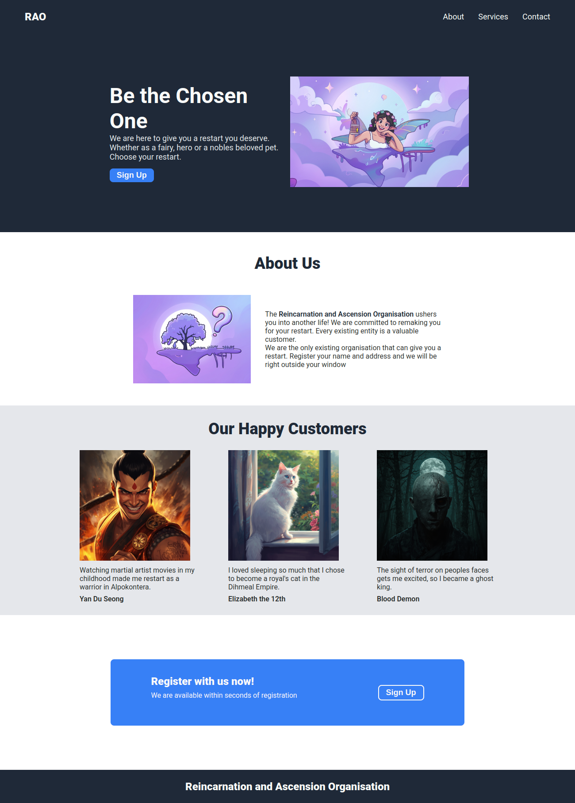

# rao-landing
A fantasy-themed landing page for the Reincarnation and Ascension Organisation (RAO) — a fictional service that offers people a chance to restart life in another world as heroes, nobles, spirits, or even royal pets.

The project focuses on clean semantic HTML, reusable CSS utility classes, flexbox layouts, and structured landing page design.

## Preview

## Features
- Semantic HTML5 structure
- Responsive flexbox-based layout
- Reusable utility classes (.flex, .center)
- Hero section with CTA
- About section
- Customer testimonial cards
- Registration call-to-action section
- Clean typography using Roboto

## Technologies Used
- HTML5
- CSS3
- Google Fonts

### Author

- Created as a practice project for The Odins Project Foundations Course

## Image Credits

- The hero and about section images were created in [Magnific](https://www.magnific.com/app), based on photo by [Anthony Tran](https://unsplash.com/@anthonytran) on [Unsplash](https://unsplash.com/photos/woman-in-white-dress-wearing-green-fairy-wings-5d41p_9vlOk) and illustration by [Gabriele Romano](https://unsplash.com/@gabrieleromanoy/illustrations) on [Unsplash](https://unsplash.com/illustrations/silhouette-of-a-tree-on-a-floating-island-at-night-cPWStfO8OFw)

- The customer section images were generated using [Canva AI Character Generator](https://www.canva.com/ai-character-generator/)